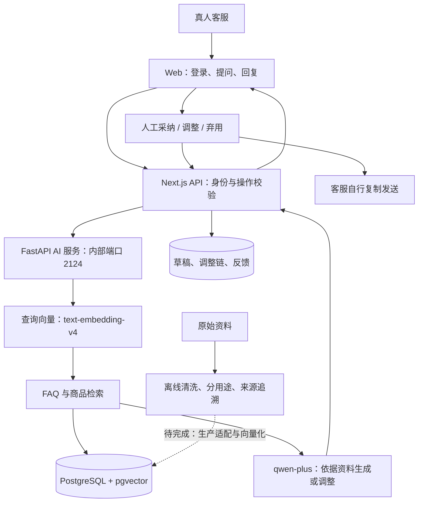

# 架构与扩展位置

## 架构结论

保留 Next.js Web、Python AI 服务和 PostgreSQL 三部分，集中到一个仓库。当前规模不需要拆成更多微服务或重写已有功能。先明确边界、补齐可复现环境，再改造知识发布。

“一个仓库、两个服务”指代码一起管理，网页和 AI 后端分别启动。跨网页和后端的功能可以在同一次提交中审查。

## 模块职责

| 模块 | 职责 | 主要文件 |
|---|---|---|
| 工作台页面 | 输入、回复、调整面板、历史记录 | `web/src/app/workbench/` |
| Web API | 账号权限、草稿保存、调整次数和幂等、反馈 | `web/src/app/api/drafts/`、`adjustments/`、`feedback/`、`history/` |
| 登录和管理员 | 会话、角色、账号、反馈筛选导出 | `web/src/lib/auth/`、`web/src/app/api/auth/`、`admin/` |
| AI HTTP 边界 | 内部 token 校验、请求响应结构、生命周期 | `agent/src/api/app.py`、`agent/src/agent/models.py` |
| 检索与拟稿 | 相关性、上下文、模型输入、调整历史 | `agent/src/agent/graph.py`、`tools.py`、`prompt.py` |
| 数据访问 | 参数化 SQL、连接池、有效知识版本 | `agent/src/agent/repository.py`、`web/src/lib/db/` |
| 向量适配 | 将整句话转为检索向量 | `agent/src/agent/embedding.py` |
| 知识准备 | 合并来源、保留差异、区分用途、向量任务 | `knowledge/scripts/` |

`graph.py` 是当前检索与生成的编排入口；不要仅根据历史项目名假定所有逻辑已经构成复杂的 LangGraph 图。

## 接口与数据约定

Web 服务端访问 `http://127.0.0.1:2124`；浏览器不持有模型密钥或内部 token。地址目前写在 `web/src/lib/agent-client.ts`，默认同机运行；拆机或容器化前应改为环境配置。

Agent 提供 `GET /health`、`POST /v1/drafts`、`POST /v1/adjustments`。生成请求为 `question`；调整包含 `question`、`previous_drafts`、`instruction`。后两者要求 `x-internal-token`。响应包括 `run_id`、`intent`、`answer_mode`、`draft`、知识命中及模型/提示词/知识版本。

Web 通过会话识别账号，不能接受浏览器自报管理员身份。数据关系：

- `knowledge_releases`：发布版本，只允许一个 active 版本。
- `business_faq_cards` / `business_faq_phrases`：FAQ 及问法向量。
- `workbench_products` / `workbench_skus` / `workbench_product_chunks`：商品快照与知识片段。
- `workbench_users` / `workbench_sessions`：账号、会话。
- `draft_runs`：问题、命中快照、AI 草稿、版本。
- `draft_adjustments`：原稿、上一稿、新稿、轮次、建议、请求 ID。
- `feedback_records` / `review_items`：客服反馈、后台审核。

调整由 Web 事务与数据关联限制最多 3 次成功生成。失败、资料不足、去空白后与历史完全相同不计成功轮次。成功请求重试复用结果，每轮反馈绑定当前稿件；不能仅依赖页面按钮状态。

## 已确认的业务边界

1. 不自动联系客户，不给 AI 接消息发送、退款、改单工具。
2. 静态库存、价格、物流不能冒充实时状态；改写建议不能覆盖业务事实。
3. 客服反馈供人工改进，不能自动发布为正式知识。
4. 知识与问题向量使用匹配的模型、维度和预处理；当前为 `text-embedding-v4`、1024 维。
5. 生成与向量模型可以不同供应商；当前共用百炼密钥，拆分配置是待办。

## 后续功能的改动位置

| 需求 | 改动边界 | 验证重点 |
|---|---|---|
| 调整选项、历史体验 | Web 页面和调整 API | 失败重试、3 次限制、反馈绑定 |
| 沟通提示、必要追问 | Agent 响应模型 + Web 契约 + 页面 | 提示依据、资料不足、不增加必填负担 |
| 9 月新知识 | 数据适配器 + Repository + 发布脚本 | 用途过滤、来源、条件、向量一致性、回退 |
| 更换回复模型 | Settings + 模型实例 | 向量配置独立，不意外重建知识向量 |
| 实时业务数据 | 独立只读适配器 | 数据新鲜度、错误回退、禁止订单操作 |
| 域名与私有部署 | 配置、反向代理、运维 | Cookie、HTTPS、端口、备份恢复 |

这些是扩展方向，不代表已实现。本次主要完成组织、可移植运行说明及知识脚本入口。
